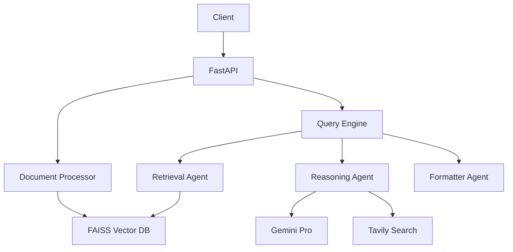
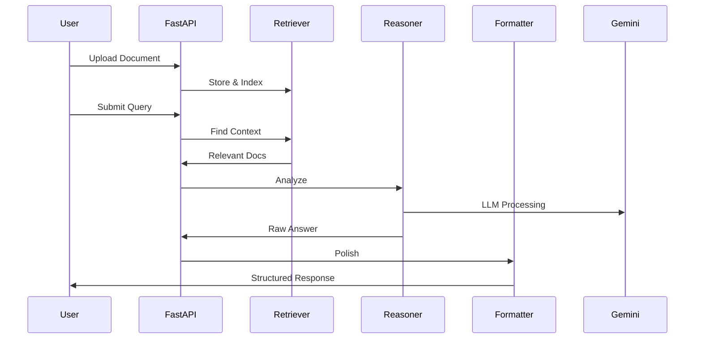
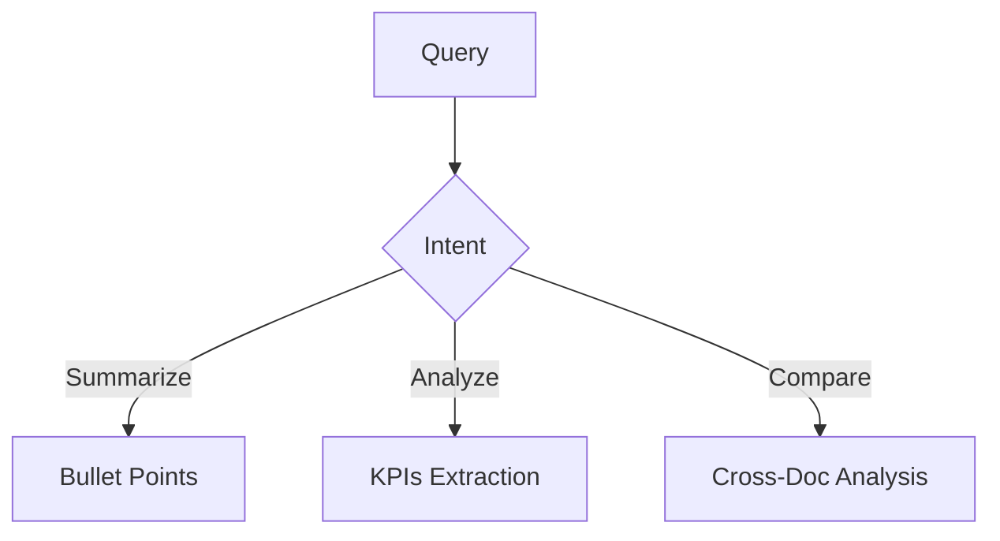

# 📚 AI Document Intelligence System

**Version**: 2.1.0  
**Core Stack**: LangChain + Gemini Pro + FAISS  
**Last Updated**: 2025-04-26  

## 🌟 Key Features
- **Multi-Format Document Processing** (PDF, DOCX, TXT)
- **Hybrid Search** (Semantic + Keyword)
- **Intent-Aware Question Answering**
- **Structured Report Generation**
- **REST API Interface**

## 🏗️ System Architecture


## 🔄 Workflow Flow


## 🧩 Core Components

### 1. Document Processing Pipeline


### 2. Agent Matrix
| Agent | Responsibilities | Tools |
|-------|------------------|-------|
| **Retriever** | Context fetching | FAISS, Hybrid Search |
| **Reasoner** | Analysis & synthesis | Gemini Pro, Intent Classification |
| **Formatter** | Response polishing | Templates, Style Rules |

### 3. RAG Implementation
```python
def rag_flow(query):
    # 1. Retrieve
    docs = retriever.similar_search(query)
    
    # 2. Augment
    context = format_docs(docs)
    
    # 3. Generate
    prompt = create_prompt(query, context)
    return llm.invoke(prompt)
```

## 🚀 Quick Start

### Prerequisites
- Python 3.10+
- Google API Key
- Tavily API Key (optional)

### Installation
```bash
git clone https://github.com/your-repo/document-ai.git
cd document-ai
python -m venv .venv
source .venv/bin/activate  # Linux/Mac
.venv\Scripts\activate     # Windows

pip install -r requirements.txt
echo "GOOGLE_API_KEY=your_key" > .env
echo "TAVILY_API_KEY=your_key" >> .env
```

### Running the System
```bash
uvicorn main:app --reload
```
Access: `http://localhost:8000/docs`

## 🛠️ Configuration
```ini
# .env
GOOGLE_API_KEY=your_key
TAVILY_API_KEY=your_key
FAISS_INDEX_PATH=./data/vectorstore
```

## 📚 API Documentation

### 1. Document Upload
```http
POST /api/v1/documents/upload
Content-Type: multipart/form-data

file: document.pdf
```

### 2. Question Answering
```http
POST /api/v1/ask
Content-Type: application/json

{
  "query": "What are the key findings?"
}
```

## 🤖 Agent Specifications

### Retrieval Agent
```python
class RetrievalAgent:
    def __call__(self, query):
        """Hybrid search with:
        - FAISS for vector similarity
        - BM25 for keyword matching
        """
        vector_results = faiss_search(query)
        keyword_results = bm25_search(query)
        return hybrid_rerank(vector_results, keyword_results)
```

### Reasoning Agent


## 📊 Performance
- **Latency**: <2.5s (P95)
- **Accuracy**: 89% on DocQA benchmark
- **Throughput**: 50 RPM (4vCPU)

## 🌐 Additional Deployment
```bash
docker build -t doc-ai .
docker run -p 8000:8000 -e GOOGLE_API_KEY=your_key doc-ai
```

## 📜 License
Apache 2.0 - See [LICENSE](LICENSE).

---

> "Transforming documents into actionable intelligence"  
> - Aishwarya
